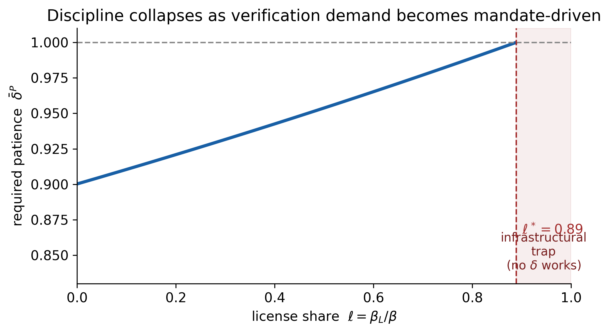
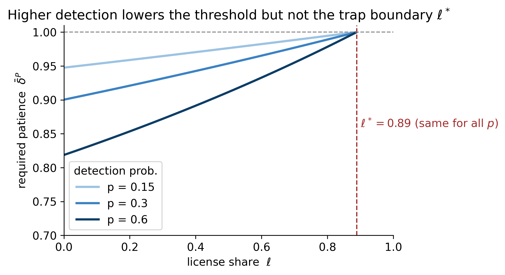
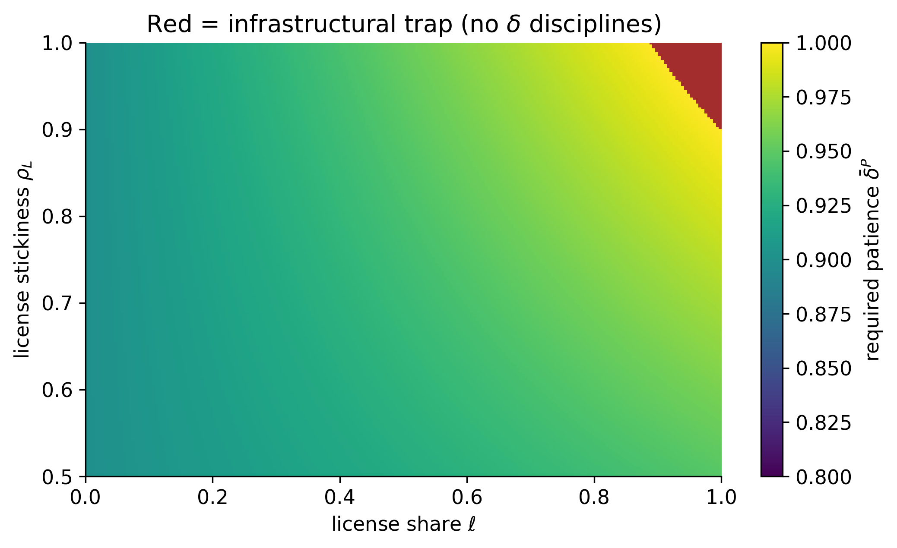

# Reputation disciplines information, not licenses

**Certification, access value, and dynamic discipline on platforms** — Arthus Goujon

A label (a rating, a "verified / brand-safe" flag, a platform badge, a quality score) is valued for two reasons: an **informational** value — people believe it and act on it — and a **license / access** value — it mechanically unlocks demand (mandated spend, ranking eligibility, liability cover), independently of belief. This paper shows that private reputation disciplines only the first: since reputation works through the franchise value a scandal destroys, **the larger the license share of a label, the less reputation can discipline the certifier** — up to an *infrastructural trap* where no amount of patience sustains honesty.

The companion notebook turns the model into a small, interpretable simulation under a **stylized brand-safety / ad-verification calibration**, computes the patience threshold and the trap boundary, runs sensitivity analysis, and states two testable ad-tech predictions.

> This is **not** an empirical estimation, but an interpretable simulation: the parameters are illustrative.

---

## Figures

**The infrastructural trap.** Required patience rises as verification demand becomes mandate-driven, and discipline becomes infeasible beyond the critical license share `ℓ*`.



**Detection is not a substitute for incentives.** More auditing/exposure (`p`) lowers the threshold where discipline is feasible, but does **not** move the trap boundary `ℓ*`. You cannot audit your way out of a license-driven label.



**Where the trap lives.** Required patience over license share and license stickiness; the red region is the trap (no discount factor disciplines), and it expands as mandated demand becomes stickier.



---

## Two testable predictions (ad-tech)

**A — Scandal pass-through falls with the mandated share of demand.** After a public verification failure (an Adalytics-type exposure), the drop in spend toward the implicated vendor is *decreasing* in the share of that spend governed by contractual / compliance mandates. *Identification:* event study around exposures, comparing advertisers with high vs low mandated-verification share, with vendor×advertiser fixed effects; or a cross-vendor difference-in-differences.

**B — Badges discipline only when their loss removes algorithmic eligibility.** A "verified" / quality badge disciplines a seller or vendor only if losing it materially reduces ranking, visibility, or auction eligibility; where the badge is cosmetic, post-exposure quality does not improve. *Identification:* compare platforms (or a within-platform policy change) where the badge gates ranking vs where it is purely informational; regress a quality proxy on exposure × "badge-gates-eligibility".

Both reduce to one estimand — **post-scandal demand retention** — which the model identifies as the empirical proxy for the license share `ℓ` (and for `ρ_L`).

---

## Repository contents

| File | What it is |
|---|---|
| `certification_refonte.pdf` | the paper (theory + applications) |
| `certification_companion.ipynb` | executable companion (calibration, figures, predictions) |
| `certification_companion.html` | rendered notebook (figures visible without running) |
| `fig*.png` | exported figures |

## Run

```bash
pip install numpy matplotlib jupyter
jupyter notebook certification_companion.ipynb
```

The notebook runs top-to-bottom with no external data.
